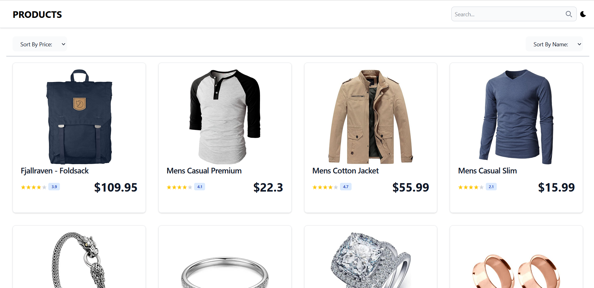
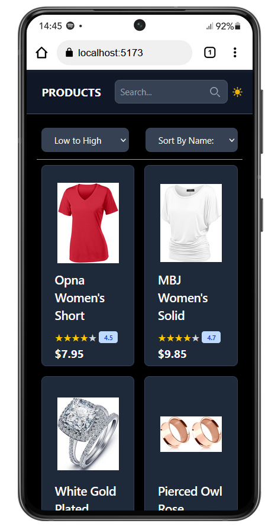

# Products Gallery Web App

## Overview
This is a responsive **Products Gallery** web application built with **React** and **Context API**.  
The app fetches products from [Fake Store API](https://fakestoreapi.com/) and allows:
- Product browsing and details.
- Search by product name.
- Sort by **Price (Low to High / High to Low)** and **Name (A–Z)**.
- Dark/Light mode toggle.

---

## Features
- **React (v18+)** with functional components.
- **Context API** for state management.
- **Axios** for API requests.
- **Tailwind CSS** for responsive design.
- Search with `Enter` or search icon.
- Sort dropdown (Price & Name).
- Dark/Light mode with local storage.

---

## Technologies Used
- **React**
- **React Router DOM**
- **Axios**
- **Tailwind CSS**
- **Fake Store API**

---

## Screenshots
<p align="center">
  
  
</p>
<p align="center">
  
</p>

---

## Installation & Setup
1. Clone the repository:
   ```bash
   git clone https://github.com/username/products-gallery.git
